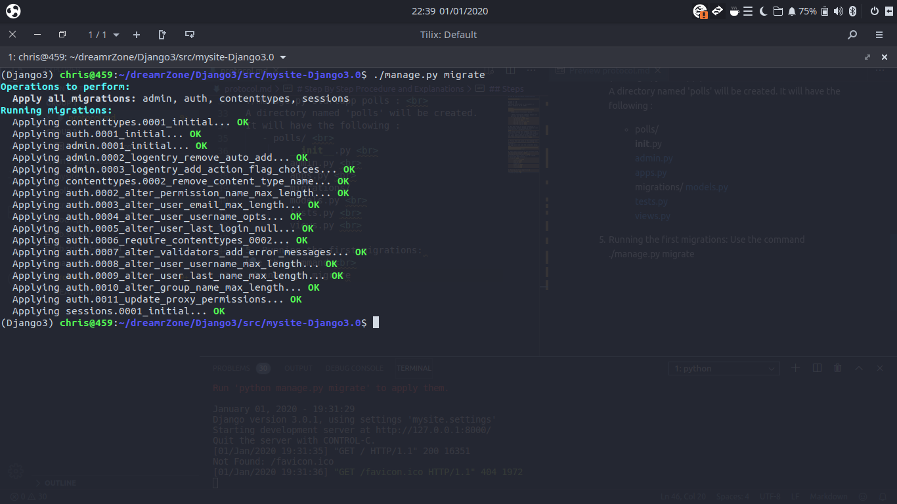
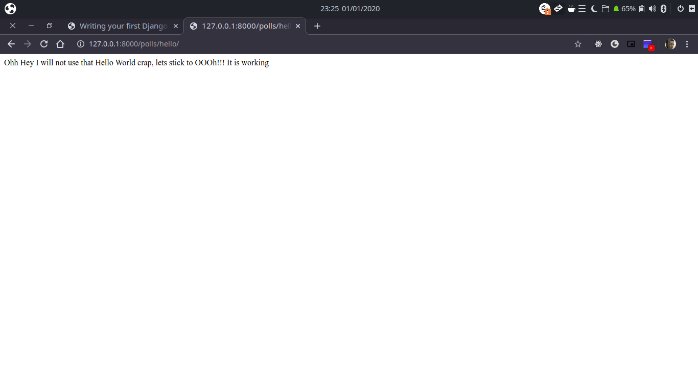
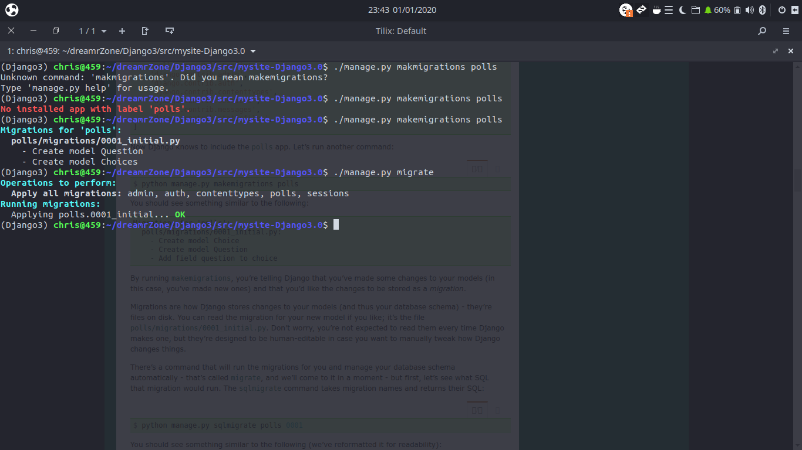

# Step By Step Procedure and Explanations

### Requirements:

Django => 3.0
Python => 3.6
Operating System Used in Development is Ubuntu (Budgie) 19.10 (2019)

## Steps
1. Start your Django Project Using the Command: 
    django-admin startproject mysite

    - After running the command, django will generate your project files:
        ─ db.sqlite3  
        ├── manage.py    
        ├── mysite  
        │   ├── settings.py  
        │   ├── urls.py  
        │   └── wsgi.py  

2. Run the server to ensure everything is functioning: python3 manage.py runserver //or alternatively ./manage.py runserver.
 
First time running this command, you'll be informed that "You have 17 unapplied migration(s). Your project may not work properly until you apply the migrations for app(s): admin, auth, contenttypes, sessions.".  

3. Follow the link given in the command tool: http/127.0.0.1:8000 in your browser... 
It works!!!
The page will look like the screenshot below  
</img>

4. Start your first app in your project using the following command :  
./manage.py startapp polls :  
A directory named 'polls' will be created.
It will have the following :
   - polls/  
        __init__.py  
        admin.py  
        apps.py  
        migrations/
        models.py  
        tests.py  
        views.py  

5. Running the first migrations: 
Use the command  
./manage.py migrate  
This creates the admin database tables 
</img>

6. Printing Hello World in Django  
This a pretty common part for programmers...
 
So we start, open polls/views.py and put the following code as in my file.
In the views, we define what we want end-users to see from our project. So for it to be seen in a web page, we have to give it a url... so we go to polls/urls.py and write the code as in mine.
Since polls/urls.py was not creates initialy, we have to register it win the main urls file in mysite/urls.py 
Now got to your browser and navigate to http://127.0.0.1:8000/polls/hello/ .... and Voila!!!
This what you get 
</img>

7. Creating Models (a.k.a Tables in database)
 
Go to polls/models.py and edit as done in my file
After that, we need to register the models, but before that, we need to register the app in settings.py otherwise you'd get an error when doing that. The Error message will be : "No installed app with label 'polls'."
Go to mysite/settings.py and located INSTALLED_APPS and add 'polls.apps.PollsConfig',
With that done, run the following commands to get the models ready:  
    - ./manage.py makemigrations polls  
    - ./manage.py migrate 
</img>

8. Using Django Shell API
 
Using Django's shell through the python interactive shell.  
Start by:  ./manage.py shell  
First we explore the database api:  
    - write 
        from polls.models import Choice, Question  # Import the model classes we just wrote.
        Question.objects.all() # to check for anything stored under Question model
        from django.utils import timezone # Django expects a datetime with tzinfo for pub_date. Use timezone.now()
        q = Question(question_text="What's new?", pub_date=timezone.now())
        q.save() # Save the object into the database. You have to call save() explicitly.
        q.id # Now it has an ID.
        q.question_text #  Access model field values via Python attributes.
        q.pub_date
        q.question_text = "What's up?" # Change values by changing the attributes, then calling save().
        q.save()
        Question.objects.all() # objects.all() displays all the questions in the database.
            -after running the command the output is as :  
            <QuerySet [<Question: Question object (1)>]>, which is not good at all, go to models.py and add  __str__() method to both Question and Choice:
            With that done, restart the shell.
    Start over with the following commands:
        -from polls.models import Choice, Question
        -Question.objects.all() # Make sure our __str__() addition worked.
        -Question.objects.filter(id=1) # Django provides a rich database lookup API that's entirely driven by keyword arguments.
        -from django.utils import timezone # Get the question that was published this year.
        -current_year = timezone.now().year
        -Question.objects.get(pub_date__year=current_year)
        -Question.objects.get(id=2) # Request an ID that doesn't exist, this will raise an exception.
        -Question.objects.get(pk=1) # Lookup by a primary key is the most common case, so Django provides a shortcut for primary-key exact lookups. The following is identical to Question.objects.get(id=1).
        -q = Question.objects.get(pk=1) # Make sure our custom method worked.
